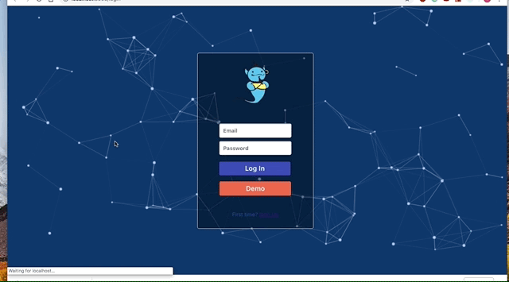
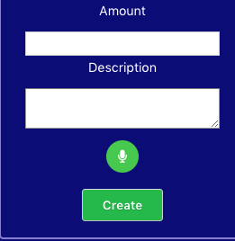

# Genie

_Your personal financial management tool_

[Live Site](https://genie-flex-project.herokuapp.com/)

## Background and Overview

Genie is a personal daily financial management app, which users can utilize to keeps tracks of their personal budgets and spending. Users have the options of voice input and text input to record transactions.

## Functionality and MVP

- [ ] User authorization: sign up and log in

- [ ] Users can create personalized categories to keep track of their income/expenses

- [ ] Users can use voice input to record transactions

- [ ] Users will be personalized dashboard to view graphs created based on their account information

## Technologies & Technical Challenges

- Backend: `MongoDB` / `Express` / `Node.js`
- Frontend: `React` / `Redux`
- `Web Audio API` for voice input to text

## Login / Sign Up Page

Users can login or sign up through this page.

## Dashboard

Users can view their net income graph, expense graph and recent transactions. Users can also create a category or transcation at the sidebar.

For a better user experience, we added a voice recognition features for users to record details of the new transaction.
