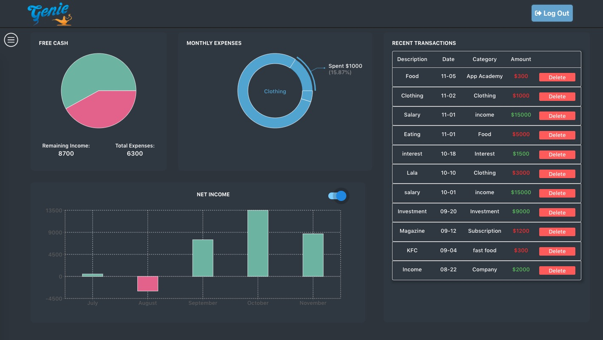
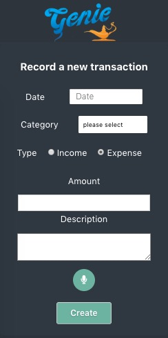

# Genie

_Your personal financial management tool_

[Live Site](https://genie-flex-project.herokuapp.com/)

## Background and Overview

Genie is a personal financial management app, which users can utilize to keep tracks of their personal budgets and spendings. Genie also incorporates Web Speech API so users can choose from voice or text when creating transactions.

## Technologies & Technical Challenges

- Backend: `MongoDB` / `Express` / `Node.js`
- Frontend: `React` / `Redux`
- `Web Audio API` for voice input to text

## Login / Sign Up Page

Log in and Sign up page uses particles as background, users can also interact with the particles by moving or clicking the mouse.

## Dashboard

The dashboard is the most important page that contains almost all the information for the users to track their personal financial status. Users can view their net income graph, expense graph, and recent transactions tables.

Genie visualizes users' transaction data into dynamic graphs and charts.

Users can create a category or a new transcation inside the sidebar. For a better user experience, Genie also enabled a voice recognition feature for users to record details of the new transaction.

